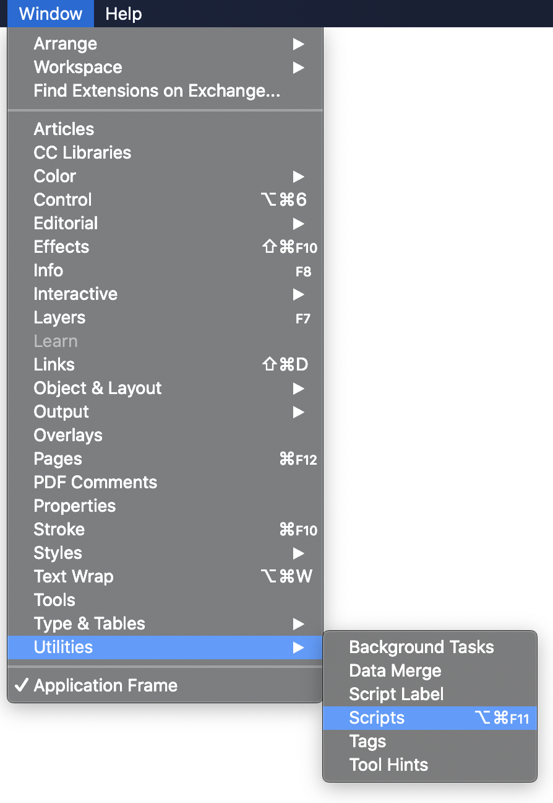
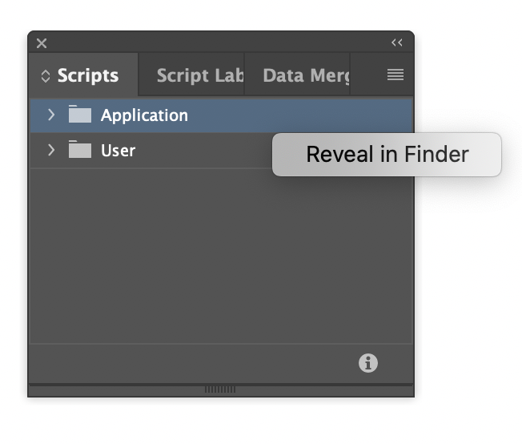

# indesign.page-id

Script to track pages by an id.

## Usage

The script adds a little textbox in the top left corner of each page with an unique id. If you move the page you can later track the movement by re-run the script and read out the ID's again.

## installation

### open scriptpannel

### show script location in finder

Copy script into this folder and double click the script in the InDesign Scripts Palette.

## Notice

This script is made for InDesign. So we can not use some fancy JavaScript but just old ECMAScript 3.
